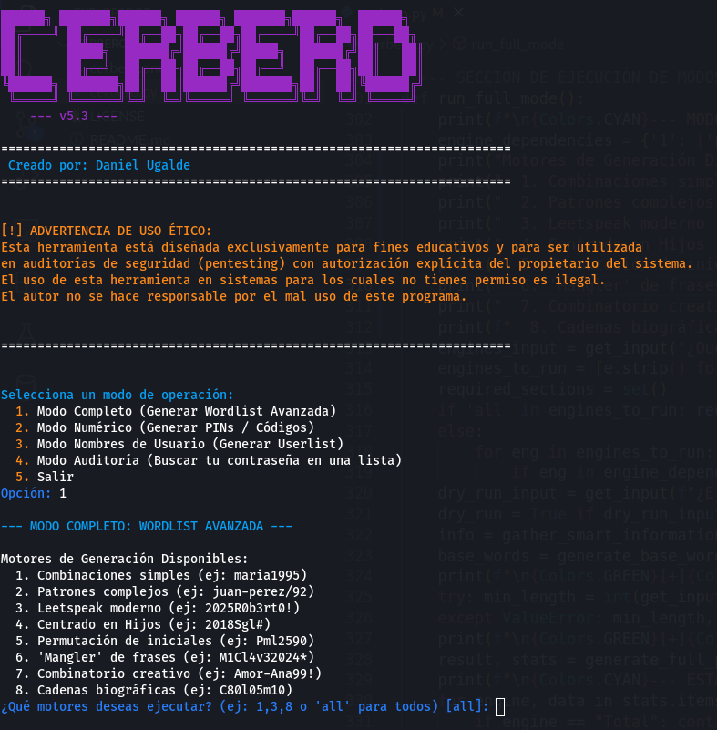

# Cerbero - Suite de Perfilado de Credenciales

<p align="center">
  
</p>

<p align="center">
  <strong>Una herramienta de línea de comandos en Python para generar wordlists contextuales y de alta precisión para auditorías de seguridad.</strong>
</p>

<p align="center">
  
  
  
</p>

---

**Cerbero** es una suite de herramientas diseñada para el perfilado de credenciales. Su objetivo es generar listas de nombres de usuario y contraseñas altamente personalizadas, simulando los patrones que las personas reales usan para crear sus credenciales. A diferencia de generadores genéricos, Cerbero utiliza datos contextuales (OSINT) para aumentar drásticamente la efectividad en auditorías de seguridad y pentesting ético.

## 🚀 Características Principales

-   **🧠 Cuestionario Inteligente:** Solo pregunta la información relevante para los motores de generación que selecciones.
-   **⚙️ Arquitectura Multi-Motor:** Utiliza 8 lógicas de ataque distintas, desde combinaciones simples hasta patrones biográficos complejos.
-   **🎯 Modos Especializados:** Incluye generadores específicos para contraseñas, nombres de usuario y PINs numéricos.
-   🛡️ **Modo de Auditoría Defensiva:** Permite a un usuario verificar si sus propias contraseñas son vulnerables y predecibles.
-   **✨ Normalización Unicode:** Maneja automáticamente acentos y caracteres especiales (ej: `José` -> `jose`).
-   **🎛️ Control Total:** Permite activar/desactivar motores, definir límites de longitud y ejecutar en modo simulación (`dry run`).
-   **📊 Estadísticas Detalladas:** Informa cuántas contraseñas generó cada motor y el tiempo que tardó.
-   **🎨 Interfaz Moderna:** Una UI de terminal limpia y con colores para una mejor experiencia de usuario.
-   **🐍 Python Puro:** Sin dependencias externas, fácil de ejecutar y modificar.

## 🤖 El Poder de los 8 Motores de Generación

Cerbero combina la potencia de múltiples lógicas de ataque. Puedes ejecutar uno, varios o todos a la vez.

| Motor | Descripción                                         | Ejemplo de Contraseña Generada        |
| :---- | :-------------------------------------------------- | :------------------------------------ |
| **1** | **Combinaciones Simples:** Estilo RockYou clásico.      | `Juan1982`, `tamarapavez`             |
| **2** | **Patrones Complejos:** Estilo WiFi/corporativo.      | `kasa-tapia/329`, `Juan_Pereze#2024`  |
| **3** | **Leetspeak Moderno:** Patrón de `Año+NombreLeet`.     | `2025Ju4n%`                         |
| **4** | **Centrado en Hijos:** Usa el año e iniciales del hijo.| `2012Tpub$`                           |
| **5** | **Permutación de Iniciales:** Teje iniciales y números.| `Jtb1772` (Juan, Tamara, Bastian...) |
| **6** | **"Mangler" de Frases:** Destroza frases con Leetspeak.| `R3d$S3gura2024!#`                     |
| **7** | **Combinatorio Creativo:** Mezcla 3+ elementos.       | `Juan-Perez1982!`                  |
| **8** | **Cadenas Biográficas:** Concatena `Inicial+Año`.     | `T72b96j15` (Tamara72, Bastian96...)   |

## 🛠️ Instalación y Uso

Cerbero no requiere instalación. Solo necesitas Python 3.7 o superior.

```bash
1. Clona el repositorio:
git clone https://github.com/syruxst/cerbero.git

2. Navega al directorio:
cd cerbero

3. Ejecuta el script:
python cerbero.py
```
Aparecerá un menú interactivo que te guiará a través de los diferentes modos de operación.

⚠️ Advertencia de Uso Ético
[!] IMPORTANTE: Cerbero es una herramienta creada con fines educativos y para ser utilizada exclusivamente en auditorías de seguridad y pentesting dentro de un marco legal y con autorización explícita del propietario del sistema. El uso no autorizado de esta herramienta para intentar acceder a sistemas ajenos es ilegal. El autor no se hace responsable del mal uso de este programa.

🤝 Cómo Contribuir
¡Las contribuciones son bienvenidas! Si tienes ideas para nuevos motores, optimizaciones o correcciones, no dudes en participar.
Haz un Fork del proyecto.
Crea una nueva rama (git checkout -b feature/AmazingFeature).
Haz Commit de tus cambios (git commit -m 'Add some AmazingFeature').
Haz Push a la rama (git push origin feature/AmazingFeature).
Abre un Pull Request.
📄 Licencia
Este proyecto está bajo la Licencia MIT. Consulta el archivo LICENSE para más detalles.
👤 Autor
Daniel Ugalde - GitHub @syruxst